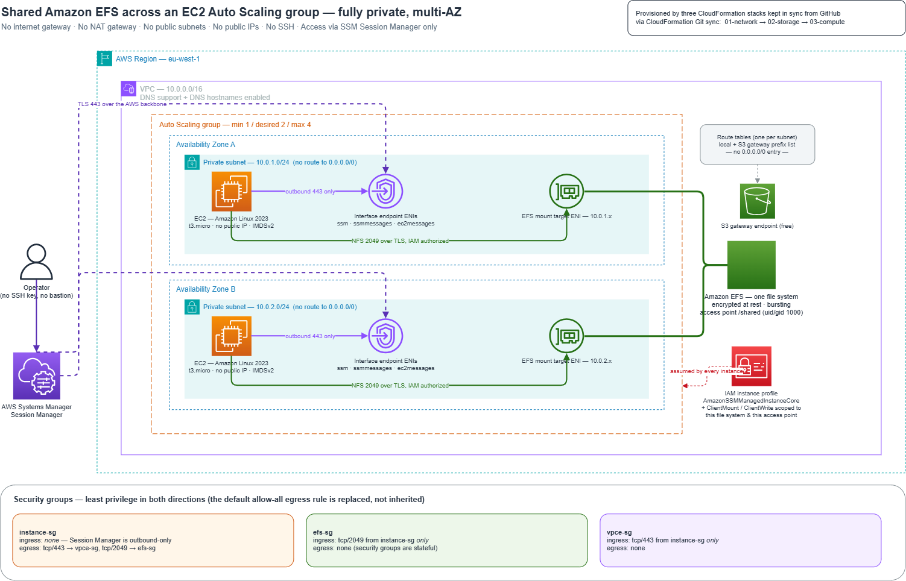

# Shared Amazon EFS across an EC2 Auto Scaling group

A highly available, fully private file-sharing architecture in a single AWS Region. An
Auto Scaling group spans two Availability Zones; every instance mounts the **same** Amazon
EFS file system at boot, giving shared read/write access. There is no internet gateway, no
NAT gateway, no public subnet, no public IP and no SSH — the only way onto an instance is
AWS Systems Manager Session Manager.

Everything is provisioned by CloudFormation, kept in sync from this repository by
CloudFormation Git sync.



> The diagram source is [diagrams/architecture.drawio](diagrams/architecture.drawio) —
> open it at [app.diagrams.net](https://app.diagrams.net) and export a PNG to
> `diagrams/architecture.png` to refresh the image above.

---

## Repository layout

```
├─ deployments/            GitSync stack deployment files (one per stack)
│   ├─ network.yaml
│   ├─ storage.yaml
│   └─ compute.yaml
├─ templates/
│   ├─ oidc-bootstrap.yaml GitHub Actions OIDC deploy role (the one manual seed)
│   ├─ 00-gitsync.yaml     Repository link, Git sync service role, sync configurations
│   ├─ 01-network.yaml     VPC, private subnets, route tables, VPC endpoints, security groups
│   ├─ 02-storage.yaml     EFS file system, mount targets, access point, file system policy
│   └─ 03-compute.yaml     IAM instance profile, launch template, Auto Scaling group
├─ scripts/
│   ├─ validate.sh         cfn-lint + server-side template validation
│   └─ verify-efs.sh       end-to-end verification, entirely through Systems Manager
├─ diagrams/architecture.drawio
└─ .github/workflows/deploy.yml    lint → staged rollout → end-to-end verification
```

## Architecture

| Layer | What it contains |
|---|---|
| **Network** (`01`) | VPC `10.0.0.0/16` with DNS support and DNS hostnames on; two private subnets (`10.0.1.0/24`, `10.0.2.0/24`) in two AZs; one route table per subnet holding **no** default route; interface endpoints for `ssm`, `ssmmessages` and `ec2messages` in both AZs; a free S3 gateway endpoint; three security groups |
| **Storage** (`02`) | One encrypted EFS file system (bursting throughput, IA lifecycle at 30 days); one mount target per subnet — one per AZ, which is the maximum EFS allows; an access point rooted at `/shared`; a file system policy that denies any connection not encrypted in transit |
| **Compute** (`03`) | IAM role carrying `AmazonSSMManagedInstanceCore` plus EFS client permissions scoped to this one file system *and* this one access point; a launch template that mounts EFS from user data; an Auto Scaling group with min 1 / desired 2 / max 4 across both subnets |

### Security groups

Least privilege applies in both directions. Each group declares its own egress, which
replaces CloudFormation's default allow-all egress rule rather than inheriting it.

| Group | Ingress | Egress |
|---|---|---|
| `instance-sg` | **none** — Session Manager is an outbound-only channel | tcp/443 → `vpce-sg`; tcp/2049 → `efs-sg` |
| `efs-sg` | tcp/2049 from `instance-sg` only | none (security groups are stateful) |
| `vpce-sg` | tcp/443 from `instance-sg` only | none |

### Design decisions worth knowing

These are the non-obvious choices, and each one is load-bearing:

- **`amazon-efs-utils` is installed at boot, over the S3 gateway endpoint.** It is *not*
  on the AL2023 AMI, contrary to what much of the documentation implies; without it the
  mount fails with `unknown filesystem type 'efs'`. AL2023's `dnf` mirrorlist points at a
  regional S3 bucket rather than `cdn.amazonlinux.com`, so the free gateway endpoint is
  enough and no NAT gateway is needed.
- **Instance egress must include the S3 prefix list.** Traffic to a gateway endpoint
  leaves the instance addressed to S3's public ranges, so security group rules apply to it
  like any other egress. With the route present but the rule missing, packets are dropped
  by the security group before they reach the endpoint — which presents as a broken
  endpoint rather than as a permissions problem.
- **The share is mounted by file system *id*, not DNS name.** The mount helper resolves an
  id straight to the mount target's ENI address without calling an AWS API, so no EFS
  interface endpoint is needed.
- **No `cfn-signal` / `CreationPolicy`.** `aws-cfn-bootstrap` is not on the AL2023 AMI and
  could not be installed offline, so a signal-based creation policy would stall until it
  timed out. Bootstrap success is confirmed through Session Manager instead —
  `scripts/verify-efs.sh`.
- **An EFS access point with an enforced `PosixUser`.** Session Manager drops you in as
  `ssm-user` (uid 1001), not `ec2-user` (uid 1000). The access point squashes every client
  to uid/gid 1000 regardless of the calling OS user, so a Session Manager shell can read
  and write the share without making the root directory world-writable.
- **Mount options are `tls,iam`.** Traffic is encrypted in transit and authorized by the
  instance role; the file system policy refuses anything else. `ClientRootAccess` is never
  granted — the access point makes it unnecessary.
- **Three independent stacks, not nested stacks.** Git sync does not run
  `aws cloudformation package`, so nested stacks would need their templates staged in S3.
  Independent stacks wired by `Export`/`ImportValue` keep everything in Git.

## Prerequisites

- An AWS account and the AWS CLI v2, authenticated for the target region (`eu-west-1` by
  default).
- The [Session Manager plugin](https://docs.aws.amazon.com/systems-manager/latest/userguide/session-manager-working-with-install-plugin.html)
  for `aws ssm start-session`.
- For Git sync: this repository pushed to GitHub on a `main` branch, plus an **AWS
  CodeConnections** connection to GitHub. Both are one-time console steps.

## Deploying

The three stacks must be created in order — `02` imports from `01`, and `03` imports from
both. `ProjectName` must be identical across all three, since it is the prefix for every
cross-stack export.

### Option A — the automated pipeline (the intended path)

Deployment is driven by a push, not by anybody's terminal. There are three layers, and
each one hands off to the next:

```
push to main
  └─ .github/workflows/deploy.yml        assumes a role via OIDC, no stored keys
       └─ templates/00-gitsync.yaml      repository link + sync role + sync configs
            └─ Git sync                  creates and updates 01 / 02 / 03
```

Exactly one thing cannot bootstrap itself — the trust between GitHub and AWS. That is the
seed, and it is applied once from the console.

**One-time setup**

1. **Confirm a GitHub connection exists.** In the
   [Connections console](https://console.aws.amazon.com/codesuite/settings/connections),
   check for a GitHub connection with status `AVAILABLE`, and make sure its GitHub App
   installation grants access to this repository. If there is none, create one and
   complete the browser handshake — the CLI can only leave a connection in `PENDING`.
   Copy the connection ARN.

2. **Create the deploy role.** In the CloudFormation console choose **Create stack → With
   new resources → Upload a template file**, upload
   [templates/oidc-bootstrap.yaml](templates/oidc-bootstrap.yaml), name the stack
   `efs-shared-oidc`, set `ConnectionArn` to the ARN from step 1, check the IAM
   acknowledgement, and create. Leave `CreateOidcProvider` as `No` unless the account has
   never federated GitHub Actions before — a duplicate provider fails to create.

3. **Give GitHub the two ARNs.** In the repository, **Settings → Secrets and variables →
   Actions → New repository secret**, add both stack outputs:

   | Secret | Value |
   |---|---|
   | `AWS_DEPLOY_ROLE_ARN` | the `DeployRoleArn` output |
   | `AWS_CONNECTION_ARN` | the connection ARN |

**From then on**

Push to `main`, or run the **Deploy** workflow manually from the Actions tab. It lints
every template, rolls the bootstrap stack out in stages, and finishes by proving the share
actually works. `sync_scope` lets you stop at `network` or `network-and-storage` for a
partial rollout.

The staging matters: creating a sync configuration for a stack that does not exist makes
CloudFormation create that stack at once, so enabling all three together would race —
storage and compute would fail on exports the network stack has not published yet. The
workflow therefore widens `SyncScope` one step at a time and waits for each stack to
settle before continuing.

| Sync configuration | Deployment file | Stack it manages |
|---|---|---|
| `NetworkSync` | `deployments/network.yaml` | `efs-shared-network` |
| `StorageSync` | `deployments/storage.yaml` | `efs-shared-storage` |
| `ComputeSync` | `deployments/compute.yaml` | `efs-shared-compute` |

**Editing a template and pushing to `main` is the whole workflow.** Git sync detects the
commit and updates the affected stack; the pipeline waits for that sync to reach the
commit's SHA and then re-runs the verification. `TriggerResourceUpdateOn: ANY_CHANGE`
keeps every stack's sync status tied to the latest commit, so the pipeline can always tell
"synced for this commit" from "never synced".

The pipeline creates a stack only when it does not exist yet. After that it stands back
and lets Git sync own updates, so the two never race each other on the same stack.

**Two roles, deliberately unequal.** The role GitHub Actions assumes can do very little:
it may manage `efs-shared-*` CloudFormation stacks and IAM roles, use one named
connection, and run verification commands — it holds no EC2, EFS or Auto Scaling
permissions at all. It provisions infrastructure by *passing* the privileged role rather
than wielding one: `aws cloudformation deploy --role-arn` makes CloudFormation assume the
provisioning role to do the work. That same role is what Git sync assumes, so the
permissions are identical whether a change arrives through the pipeline or through a sync.

Its trust policy carries `aws:SourceAccount` and `aws:SourceArn` conditions so no other
account's connection can assume it, and the GitHub role's trust is pinned to one
repository and one branch, so a fork's pull request cannot deploy into the account.

### Option B — direct deploy (useful as a first smoke test)

The template defaults match the deployment files exactly, so no parameter overrides are
needed:

```bash
REGION=eu-west-1

aws cloudformation deploy --region $REGION \
  --stack-name efs-shared-network \
  --template-file templates/01-network.yaml

aws cloudformation deploy --region $REGION \
  --stack-name efs-shared-storage \
  --template-file templates/02-storage.yaml

aws cloudformation deploy --region $REGION \
  --stack-name efs-shared-compute \
  --template-file templates/03-compute.yaml \
  --capabilities CAPABILITY_NAMED_IAM
```

`CAPABILITY_NAMED_IAM` is required for the compute stack because it creates a named IAM
role and instance profile.

## Verifying

Static checks first:

```bash
scripts/validate.sh eu-west-1
```

Then, once all three stacks are complete and the instances have had a couple of minutes to
register with Systems Manager:

```bash
scripts/verify-efs.sh efs-shared eu-west-1
```

The script drives everything through SSM — there is no SSH path — and checks, in order:

1. no instance has a public IP address, and the VPC has zero internet and NAT gateways;
2. every instance is `Online` in Systems Manager;
3. `/mnt/efs` is mounted on every instance;
4. a file written on one instance is readable from the others, an append made by a second
   instance is visible to the first, and every instance sees every instance's boot marker.

### Doing it by hand

```bash
# list instances (no public IPs)
aws ec2 describe-instances --region eu-west-1 \
  --filters Name=tag:aws:autoscaling:groupName,Values=efs-shared-asg \
            Name=instance-state-name,Values=running \
  --query 'Reservations[].Instances[].[InstanceId,PrivateIpAddress,PublicIpAddress,Placement.AvailabilityZone]' \
  --output table

# connect — no SSH key, no bastion, no open port
aws ssm start-session --region eu-west-1 --target i-0123456789abcdef0
```

Inside the session:

```bash
df -hT /mnt/efs                   # type nfs4
mount | grep /mnt/efs             # relayed through 127.0.0.1 -> TLS is active
ls -l /mnt/efs/hosts/             # one marker file per instance, all owned by uid 1000
echo "hello from $(hostname)" > /mnt/efs/greeting.txt
```

Open a session to the *other* instance and `cat /mnt/efs/greeting.txt` — same content,
different Availability Zone.

### Scaling proof

```bash
aws autoscaling set-desired-capacity --region eu-west-1 \
  --auto-scaling-group-name efs-shared-asg --desired-capacity 3
```

A few minutes later a third marker appears in `/mnt/efs/hosts/`, which shows the launch
template mounts the share unattended. If a bootstrap ever misbehaves, the full trace is at
`/var/log/efs-bootstrap.log` on the instance.

## Cost

The dominant cost is the six interface endpoint ENIs — three services across two AZs — at
roughly **$0.011 per ENI-hour, about $48/month**. Two `t3.micro` instances and a
near-empty EFS file system are small by comparison, and the S3 gateway endpoint is free.

Cost choices baked into the templates: bursting throughput rather than Elastic (Elastic
bills per request, which costs more for a mostly-idle share), a 30-day lifecycle
transition to Infrequent Access, detailed CloudWatch monitoring off, `standard` CPU credits
so a busy instance cannot silently accrue unlimited-mode charges, and automatic backups
disabled by default via `BackupPolicyStatus`.

## Tearing down

Delete in reverse order — `03`, then `02`, then `01` — because the exports are in use
until the importing stack is gone. If you deployed via Git sync, delete each sync
configuration along with its stack.

```bash
REGION=eu-west-1
for stack in efs-shared-compute efs-shared-storage efs-shared-network; do
  aws cloudformation delete-stack --region $REGION --stack-name $stack
  aws cloudformation wait stack-delete-complete --region $REGION --stack-name $stack
done
```

The EFS file system carries no retention policy, so its data is deleted with the stack.
Copy anything you want to keep first.

## Tagging

Every stack applies a common tag set — `Project`, `Component`, `Environment`, `Owner`,
`ManagedBy`, `CostCenter` — from the `tags` block of its deployment file, which
CloudFormation propagates to every taggable resource in the stack. Instances and their
root volumes additionally receive `Name` and `Role` tags from the launch template's
`TagSpecifications` and the Auto Scaling group's `PropagateAtLaunch` tags.
